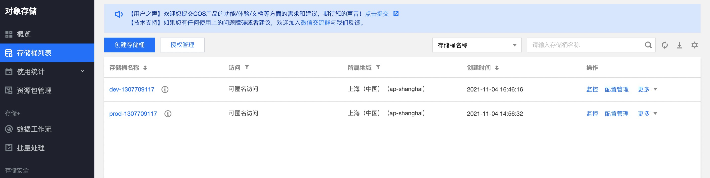
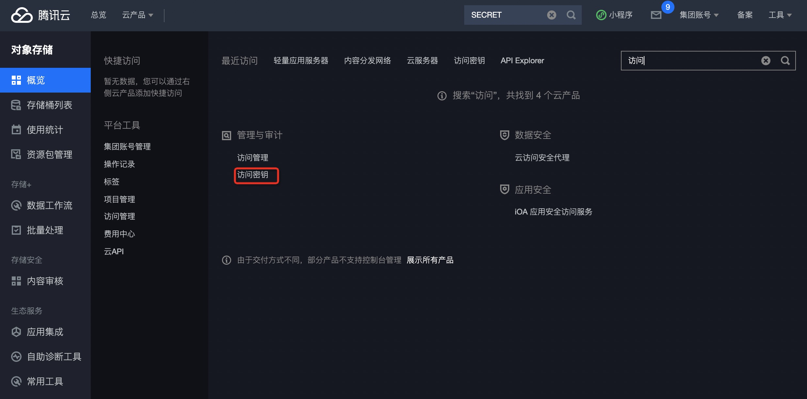
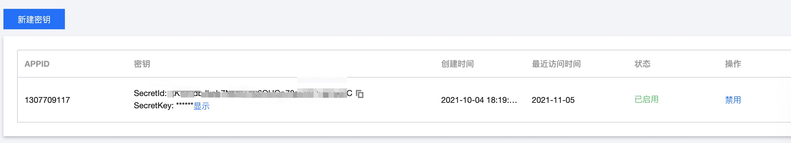
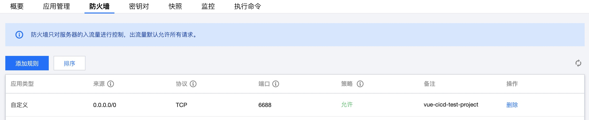
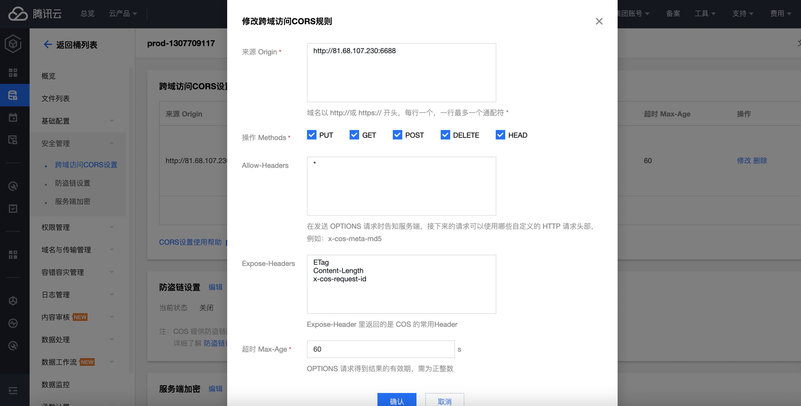
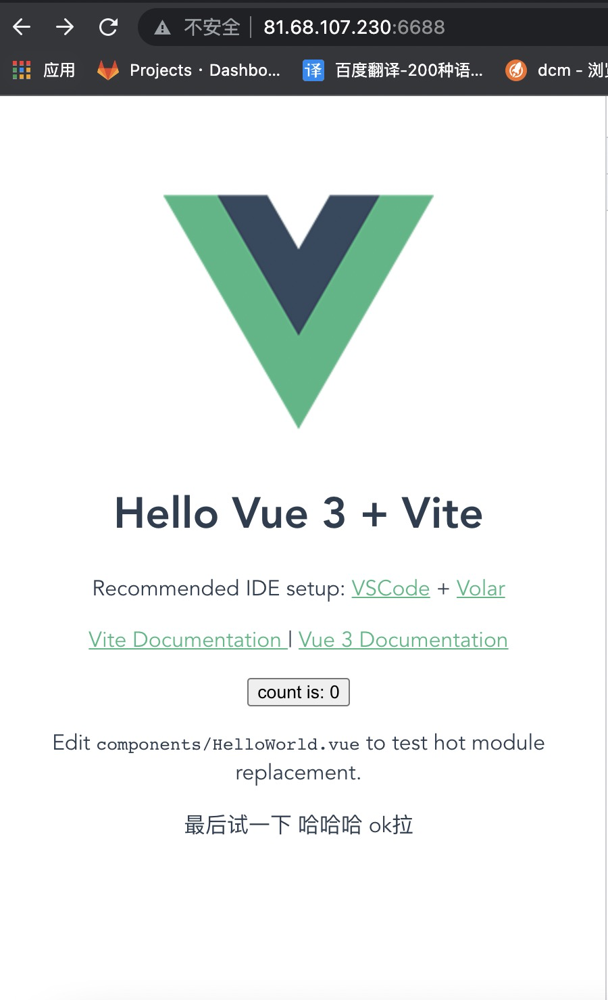

## gitlab-ci

服务器centos7，内存4g以上，需搭建好gitlab。


### 安装node

不要使用nvm等版本工具来安装nodejs，这样在运行时会找不到node和npm命令，这里我使用16.x版本

```shell
curl --silent --location https://rpm.nodesource.com/setup_16.x | sudo bash -
yum install -y nodejs
```


### 安装yarn

不要使用npm安装，会在运行时找不到yarn命令

```shell
curl --silent --location https://dl.yarnpkg.com/rpm/yarn.repo | sudo tee /etc/yum.repos.d/yarn.repo
sudo yum install yarn
```


### 安装gitlab-runner

把gitlab-runner理解成一个服务，他会持续监测仓库的变化，并判断使用哪个runner实例来运行持续集成任务
添加 GitLab’s 官方仓库:

```shell
curl -L https://packages.gitlab.com/install/repositories/runner/gitlab-runner/script.rpm.sh | sudo bash

```

下载gitlab-runner

```shell
sudo yum install gitlab-runner
```


### 注册gitlab-runner

可注册多个runner，正常情况只需在群组注册开启共享即可群组项目共同使用

```shell
sudo gitlab-runner register # 注册gitlab-runner实例
```

- GitLab的url：指定gitlab域名
- GitLab的token信息：对应项目的token
- runner的描述：一个容易记忆的名称
- runner的标签，用逗号分开：testtag，这个很重要，脚本的tags字段与这里是有对应关系的，用来指定脚本在哪个runner上执行，我们可以使用一定的规范来定义，比如线上环境叫prod，测试环境叫test，这里我使用的是frontend
- runner的执行者：shell，用来执行runner的程序，这里我使用的是shell

注册好之后如果在gitlab-ci的界面上看到runner的旁边不是绿点，而是黑色三角的感叹号，可以使用 gitlab-runner start 或者 gitlab-runner run 的指令来开启runner的service，如果还不行可执行gitlab-runner verify 之后重新执行gitlab-runner start


### 修改gitlab-runner文件夹权限

注册完成后，将gitlab-runner文件夹的用户所属修改为gitlab-runner，这样gitlab-runner对其才会有执行权限。

```shell
sudo chown -R gitlab-runner:gitlab-runner /home/gitlab-runner
```

修改文件读写权限：

```shell
sudo chmod -R 777 /home/gitlab-runner
```

### 编写.gitlab-ci.yml文件

SECRET_ID,SECRET_KEY分别从CI/CD设置变量处添加，用户保护隐私信息，只在受保护分支上能访问得到。CI_COMMIT_REF_NAME为自带分支信息，当前分支为"main"即CI_COMMIT_REF_NAME值为"main"。

分为三个阶段，install安装、build打包、cos部署。

```yaml
image: node:latest

variables:
  SECRET_ID: $SECRET_ID
  SECRET_KEY: $SECRET_KEY 

stages: 
  - install
  - build
  - deploy

cache: # 缓存
  key: $CI_COMMIT_REF_NAME  # 启用每分支缓存
  paths:
    - node_modules
    - dist

install-job:
  tags:
    - frontend
  stage: install
  script:
    - echo "installing ...安装中"
    - yarn
  only:
    - main
    - dev

build-job-dev:
  tags:
    - frontend
  stage: build
  script:
    - echo "building ...dev打包中"
    - yarn build:dev
  only:
    - dev

build-job-main:
  tags:
    - frontend
  stage: build
  script:
    - echo "building ...prod打包中"
    - yarn build:prod
  only:
    - main


deploy-job:
  tags: 
    - frontend
  stage: deploy
  script: 
    - echo "deploying ...部署中"
    - node ./upload.js ${CI_COMMIT_REF_NAME} ${SECRET_ID} ${SECRET_KEY}
  only:
    - main
    - dev

```


## 对象存储cos

对象存储我使用的是腾讯云的cos，（也可使用阿里云的oss，secretID及secretKey及upload脚本需要修改成对应的）



需创建存储桶，访问权限配置为共有读私有写

### 新建秘钥





获取到secretId及secretKey

### upload.js脚本

SECRET_ID及SECRET_KEY为gitlab-ci设置的变量；若无需cicd可修改为常量，无需变量传入

```js
// upload.js
let COS = require('cos-nodejs-sdk-v5')

const fs = require('fs');
const path = require('path')

const delList = []

const Region = 'ap-shanghai'

const CURR_BRANCH = process.argv[2]
const SECRET_ID = process.argv[3]
const SECRET_KEY = process.argv[4]
let client = new COS({
  SecretId: SECRET_ID,
  SecretKey: SECRET_KEY,
});

// 获取当前分支
const bucket = CURR_BRANCH === 'dev' ? 'dev-1307709117' : 'prod-1307709117'
//判断当前字符串是否以str结束
if (typeof String.prototype.endsWith !== 'function') {
  String.prototype.endsWith = function (str) {
    return this.slice(-str.length) == str;
  };
}

/* 上传 */
function multipartUpload(src, _dist) {
  client.putObject({
    Bucket: bucket,
    Region: Region,
    Key: _dist,
    StorageClass: 'STANDARD',
    Body: fs.createReadStream(src), // 上传文件对象
    onProgress: function (progressData) {
      console.log(JSON.stringify(progressData));
    }
  }, function (err, data) {
    console.log('上传完成')
    console.log(err || data);
  });
}

/* 批量删除 */
async function deleteMulti(dist, src, objList) {
  console.log('删除数量：', objList.length)
  if (objList.length === 0) {
    addFiles(src, dist)
    return
  }
  // 删除
  client.deleteMultipleObject({
    Bucket: bucket,
    Region: Region,
    Objects: delList
  }, function (err, data) {
    console.log(err || data);
    addFiles(src, dist)
    objList = []
  });


}

/* 获取要添加的文件 */
async function addFiles(src, dist) {
  var docs = fs.readdirSync(src);
  docs.forEach(function (doc) {
    var _src = src + '/' + doc,
      _dist = dist + '/' + doc;
    var st = fs.statSync(_src);
    // 判断是否为文件
    if (st.isFile() && doc !== '.DS_Store') {
      if (_src.endsWith('.js')
        || _src.endsWith('.css')
        || _src.endsWith('.ttf')
        || _src.endsWith('.wof')
        || _src.endsWith('.png')
        || _src.endsWith('.ico')
        || _src.endsWith('.html')) {
        multipartUpload(_src, _dist)
      }
      console.log(_src + '是文件', _dist)
    }
    // 若是是目录则递归调用自身
    else if (st.isDirectory()) {
      // console.log(_src+'是文件夹')
      addFiles(_src, _dist);
    }
  })
}


/* 查询全部的资源 */
function listDir(dist, src, nextMarker) {
  client.getBucket({
    Bucket: bucket,
    Region: Region,
    Prefix: dist,
    Marker: nextMarker //起始对象键标记
  }, function (err, data) {
    console.log(err || data);
    if (data && data.Contents.length > 0) {
      data.Contents.forEach(function (obj) {
        console.log('Object: %s', obj.Key);
        delList.push({
          Key: obj.Key
        })
      });

      if (data.IsTruncated === 'true') { // 是否有更多
        console.log('-------更多数据-------', data.NextMarker)
        listDir(dist, src, data.NextMarker)
      } else {
        deleteMulti(dist, src, delList)
      }
    } else {
      addFiles(src, dist)
    }
  });

}

function uploadOSS(src, dist) {
  // 全部的
  listDir(dist, src)
}
const local = path.join(__dirname, "./dist");
uploadOSS(local, 'web')
module.exports = uploadOSS

```

访问https://prod-1307709117.cos.ap-shanghai.myqcloud.com/web/index.html即可


### vite.config.js，静态资源路径配置

```js
import { defineConfig } from 'vite'
import vue from '@vitejs/plugin-vue'

// https://vitejs.dev/config/
export default defineConfig({
  plugins: [vue()],
  base: process.env.ENV === 'dev' ?'https://dev-1307709117.cos.ap-shanghai.myqcloud.com/web/' : 'https://prod-1307709117.cos.ap-shanghai.myqcloud.com/web/'
})
```


## nginx转发

先开启防火墙通行端口，我设置的为6688



### nginx配置

转发到cos地址

```nginx
{
  server {
    listen 6688;
    server_name 81.68.107.230;
    index index.html index.htm index.php;
    
    location / {
      proxy_pass https://prod-1307709117.cos.ap-shanghai.myqcloud.com/web/index.html;  
    }
    
    location ~ .*\.(gif|jpg|jpeg|png|bmp|swf)$
    {
        expires      30d;
    }
  
    location ~ .*\.(js|css)?$
    {
        expires      12h;
    }
  }
}
```

cos配置静态资源跨域



访问http://81.68.107.230:6688，即转发成功



